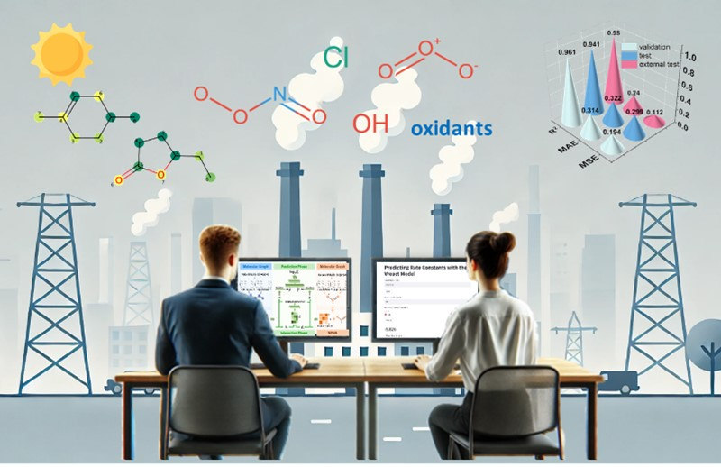

# Vreact
Volatile Organic Compounds (VOCs) significantly impact global atmospheric chemistry through oxidative reactions with oxidants. The products of these reactions are key precursors to the formation of atmospheric fine particulate matter (PM2.5) and ozone (O3), playing a decisive role in controlling O3 pollution and reducing PM2.5 concentrations. With the increasing diversity of VOCs, there is an urgent need to employ advanced big data technologies to accurately estimate the atmospheric oxidation reaction rate constants (Ki) of VOCs. This study developed a prediction model, Vreact, based on a graph deep learning algorithm to predict the atmospheric oxidation reaction rate constants of VOCs with four types of oxidants simultaneously. The Vreact model achieved a mean squared error (MSE) of 0.281 and a coefficient of determination (R²) of 0.941 on the test set. The proposed method overcomes the limitations of previous models that were restricted to single oxidant modeling and is suitable for predicting the atmospheric oxidation reaction rate constants of large-scale VOCs. Additionally, a web client (http://175.27.164.104:8002/) is provided for users to screen the oxidation reaction rate constants. The VOC oxidation reaction rate prediction method proposed in this study holds significant importance for elucidating the formation and evolution processes of fine particulate matter and ozone in complex atmospheric environments. Additionally, it serves as a crucial tool for developing effective VOC control and emission strategies.

# User Guide
The Vreact model can be utilized in two ways:

1. **Visualization via Web Interface**
    we provide an interactive web-based tool (http://175.27.164.104:8002/) to facilitate VOC oxidation rate predictions.On this interface, users can use the Vreact model to calculate the reaction rate constants between VOCs and oxidants by inputting the SMILES of VOC.

2. **Batch Predictions**
   

